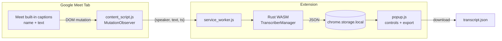
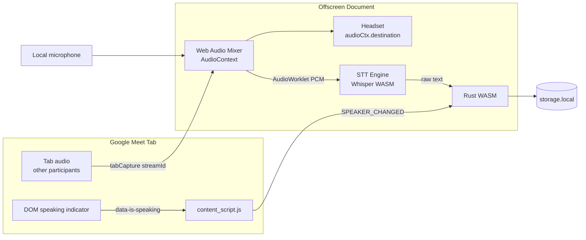
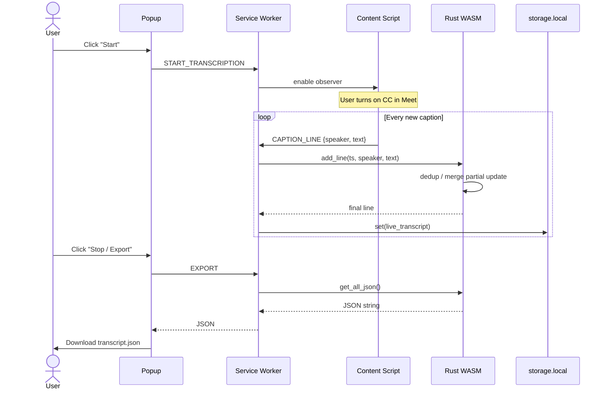
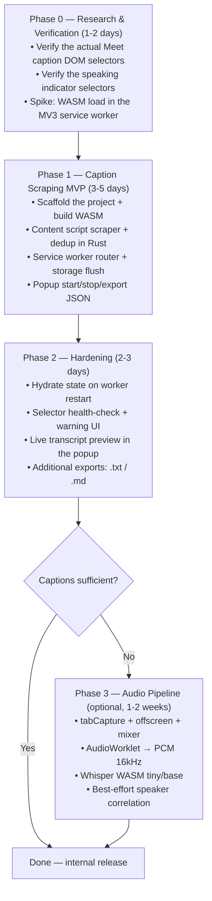

# PRD — Speaky: Real-Time Meet Transcriber (Chrome/Brave Extension, Rust/WASM)

A browser extension (Manifest V3) that captures Google Meet conversations in real time, produces a transcript with speaker names (diarization), and saves it as JSON — without any paid STT service costs.

> **Document status:** revision 2. This revision corrects the incorrect technical assumptions in the initial draft (see [§7 Feasibility Analysis](#7-feasibility-analysis-possible-vs-not-possible)) and adds execution planning.

---

## 1. Summary & Goals

| | |
|---|---|
| **Problem** | There is no free way to get a complete Meet transcript with speaker names, stored locally, without a third-party bot joining the meeting. |
| **Goal** | Real-time `{timestamp, speaker, text}` transcript from within the participant's browser, exported as JSON. |
| **Non-goal** | Raw audio recording, AI summaries, translation, support for platforms other than Meet (early phase). |
| **Target user** | The user themselves (a meeting participant) on Chrome/Brave desktop. |

---

## 2. Tech Stack

| Component | Technology | Function |
|---|---|---|
| Extension framework | Manifest V3 | Latest Chrome/Brave standard. |
| Logic engine | Rust + WebAssembly | Transcript state management (history, active speaker), JSON serialization. |
| Text source — **primary path** | **Scraping Meet's built-in captions** (DOM) | Meet captions already provide *name + text* pairs per speaker. Free, accurate, no audio pipeline needed. |
| Text source — alternative path | Whisper WASM (`whisper.cpp`) / Web Speech API | Local or browser-native STT. See limitations in §7. |
| Audio capture (alternative path) | `chrome.tabCapture` + Offscreen Document | Captures tab audio digitally (lossless, without speaker/air distortion). |
| Audio mixer (alternative path) | Web Audio API (`AudioContext`) | Combines tab audio + microphone into a single stream. |
| Diarization complement | `MutationObserver` on the Meet DOM | Detects the "currently speaking" indicator as a fallback when captions do not display a name. |
| Storage | `chrome.storage.local` | Persistence of the live transcript + final result. |

**Why two paths?** The initial draft assumed the mixed audio could be fed into the Web Speech API. **This assumption is wrong** — `SpeechRecognition` does not accept a `MediaStream` input; it only listens to the OS default microphone. Details in §7. The primary path (caption scraping) avoids the entire audio problem while getting diarization for free from Meet itself.

---

## 3. Architecture

### 3.1 Primary path — Caption Scraping (recommended, Phase 1)



Flow: the user turns on Meet captions (CC) → the content script observes the caption container → each new `{name, text}` line is sent to the service worker → Rust WASM normalizes & stores the history → the popup exports JSON.

### 3.2 Alternative path — Audio pipeline + STT (Phase 3, experimental)



Important note: the STT engine on this path **must** be Whisper WASM (or another engine that accepts a PCM buffer). The Web Speech API cannot be used here — see §7.

### 3.3 Sequence — a transcription session (primary path)



---

## 4. Project Structure

```
meet-transcriber/
├── manifest.json
├── Cargo.toml
├── src/
│   └── lib.rs                    # Rust core engine (state + serialization)
├── pkg/                          # wasm-pack output (auto-generated)
├── background/
│   └── service_worker.js         # Message router + offscreen lifecycle
├── offscreen/                    # Alternative path only (Phase 3)
│   ├── offscreen.html
│   └── offscreen.js
├── content/
│   └── content_script.js         # Caption scraper + speaker observer
└── popup/
    ├── popup.html
    └── popup.js                  # Start/stop, status, JSON export
```

---

## 5. Implementation Specification

### 5.1 `manifest.json`

> Fix from the initial draft: `host_permissions` and `matches` in the old draft contained markdown link syntax (`[https://...](...)`) — invalid, causing the extension to fail to load.

```json
{
  "manifest_version": 3,
  "name": "Speaky",
  "version": "0.1.0",
  "permissions": ["tabCapture", "offscreen", "activeTab", "storage"],
  "host_permissions": ["https://meet.google.com/*"],
  "background": {
    "service_worker": "background/service_worker.js",
    "type": "module"
  },
  "content_scripts": [
    {
      "matches": ["https://meet.google.com/*"],
      "js": ["content/content_script.js"]
    }
  ],
  "action": {
    "default_popup": "popup/popup.html"
  }
}
```

`tabCapture` + `offscreen` are only needed for the alternative path; they can be deferred from the manifest until Phase 3 to keep permission prompts minimal.

### 5.2 `Cargo.toml`

```toml
[package]
name = "meet_transcriber"
version = "0.1.0"
edition = "2021"

[lib]
crate-type = ["cdylib", "rlib"]

[dependencies]
wasm-bindgen = "0.2"
serde = { version = "1.0", features = ["derive"] }
serde-wasm-bindgen = "0.6"
serde_json = "1.0"
```

### 5.3 Core engine — `src/lib.rs`

Responsibilities: storing conversation history, deduplicating caption lines (Meet updates the same line repeatedly while a person is still speaking), and JSON serialization.

```rust
use wasm_bindgen::prelude::*;
use serde::{Serialize, Deserialize};

#[derive(Serialize, Deserialize, Clone, Debug)]
pub struct ConversationLine {
    pub timestamp: String,
    pub speaker: String,
    pub text: String,
}

#[wasm_bindgen]
pub struct TranscriberManager {
    history: Vec<ConversationLine>,
    active_speaker: String,
}

#[wasm_bindgen]
impl TranscriberManager {
    #[wasm_bindgen(constructor)]
    pub fn new() -> TranscriberManager {
        TranscriberManager {
            history: Vec::new(),
            active_speaker: "Unknown Speaker".to_string(),
        }
    }

    pub fn set_speaker(&mut self, name: String) {
        if !name.trim().is_empty() {
            self.active_speaker = name;
        }
    }

    /// Add a line. If the speaker is the same as the last line and the new text
    /// is an extension of the old text (partial caption update), the last line
    /// is replaced, not appended — preventing duplicates.
    pub fn add_line(&mut self, timestamp: String, speaker: String, text: String) -> JsValue {
        let speaker = if speaker.trim().is_empty() {
            self.active_speaker.clone()
        } else {
            self.active_speaker = speaker.clone();
            speaker
        };

        let line = ConversationLine { timestamp, speaker, text };

        let replace_last = matches!(
            self.history.last(),
            Some(last) if last.speaker == line.speaker
                && (line.text.starts_with(&last.text) || last.text.starts_with(&line.text))
        );
        if replace_last {
            *self.history.last_mut().unwrap() = line.clone();
        } else {
            self.history.push(line.clone());
        }

        serde_wasm_bindgen::to_value(&line).unwrap_or(JsValue::NULL)
    }

    pub fn get_all_json(&self) -> String {
        serde_json::to_string_pretty(&self.history).unwrap_or_else(|_| "[]".to_string())
    }

    pub fn reset(&mut self) {
        self.history.clear();
        self.active_speaker = "Unknown Speaker".to_string();
    }
}
```

### 5.4 Content script — `content/content_script.js`

Two jobs: (a) scrape Meet's built-in captions, (b) fallback observer for the speaking indicator.

```javascript
// (a) Scraper for Meet's built-in captions.
// Meet caption container: div[role="region"] with a caption aria-label,
// each line contains a name element + a text element. The selectors MUST be
// re-verified against the actual Meet DOM at implementation time (obfuscated
// classes change periodically) and kept centralized in a single SELECTORS object.
const SELECTORS = {
  captionRegion: '[aria-label*="aption"], [jsname][role="region"]',
  captionSpeaker: '.zs7s8d, [data-speaker-name]',
  captionText: '.iTTPOb, [jsname="tgaKEf"]',
};

let observing = false;
const captionObserver = new MutationObserver(() => {
  const region = document.querySelector(SELECTORS.captionRegion);
  if (!region) return;
  region.querySelectorAll(':scope > div').forEach((row) => {
    const speaker = row.querySelector(SELECTORS.captionSpeaker)?.textContent?.trim() ?? '';
    const text = row.querySelector(SELECTORS.captionText)?.textContent?.trim() ?? '';
    if (!text) return;
    chrome.runtime.sendMessage({
      type: 'CAPTION_LINE',
      speaker,
      text,
      ts: new Date().toISOString(),
    });
  });
});

// (b) Fallback: the "currently speaking" indicator to supply the name
// when the caption line does not include a name.
let lastActiveSpeaker = '';
const speakingObserver = new MutationObserver(() => {
  const active = document.querySelector('[data-is-speaking="true"]');
  if (!active) return;
  const name = active
    .querySelector('[data-self-name], [data-participant-name]')
    ?.textContent?.trim();
  if (name && name !== lastActiveSpeaker) {
    lastActiveSpeaker = name;
    chrome.runtime.sendMessage({ type: 'SPEAKER_CHANGED', name });
  }
});

chrome.runtime.onMessage.addListener((msg) => {
  if (msg.type === 'START_TRANSCRIPTION' && !observing) {
    observing = true;
    captionObserver.observe(document.body, { childList: true, subtree: true, characterData: true });
    speakingObserver.observe(document.body, {
      subtree: true,
      attributes: true,
      attributeFilter: ['data-is-speaking'],
    });
  } else if (msg.type === 'STOP_TRANSCRIPTION' && observing) {
    observing = false;
    captionObserver.disconnect();
    speakingObserver.disconnect();
  }
});
```

### 5.5 Service worker — `background/service_worker.js`

> Fix from the initial draft: (1) an `async` listener directly on `onMessage` closes the channel before `sendResponse`; (2) `sender.tab.id` is absent when the message comes from the popup — `START` must explicitly resolve the active Meet tab; (3) the WASM is loaded here (in the service worker), not only in the offscreen document, because the primary path has no offscreen document.

```javascript
import init, { TranscriberManager } from '../pkg/meet_transcriber.js';

let manager;
const ready = init().then(() => {
  manager = new TranscriberManager();
});

async function getMeetTab() {
  const [tab] = await chrome.tabs.query({
    active: true,
    currentWindow: true,
    url: 'https://meet.google.com/*',
  });
  return tab;
}

chrome.runtime.onMessage.addListener((message, sender, sendResponse) => {
  (async () => {
    await ready;

    switch (message.type) {
      case 'START_TRANSCRIPTION':
      case 'STOP_TRANSCRIPTION': {
        const tab = await getMeetTab();
        if (tab) chrome.tabs.sendMessage(tab.id, { type: message.type });
        sendResponse({ ok: !!tab });
        break;
      }
      case 'CAPTION_LINE': {
        manager.add_line(message.ts, message.speaker, message.text);
        await chrome.storage.local.set({ live_transcript: manager.get_all_json() });
        break;
      }
      case 'SPEAKER_CHANGED': {
        manager.set_speaker(message.name);
        break;
      }
      case 'EXPORT': {
        sendResponse({ json: manager.get_all_json() });
        break;
      }
      case 'RESET': {
        manager.reset();
        await chrome.storage.local.remove('live_transcript');
        break;
      }
    }
  })();
  return true; // keep the message channel open for async sendResponse
});
```

MV3 note: the service worker can die (idle ~30 seconds). The WASM's in-memory state is lost when that happens. Mitigation: every `CAPTION_LINE` is already flushed to `storage.local`; when the worker wakes up again, hydrate `manager` from `live_transcript`. This must be implemented in Phase 2.

### 5.6 Popup — `popup/popup.js` (core)

```javascript
document.getElementById('start').onclick = () =>
  chrome.runtime.sendMessage({ type: 'START_TRANSCRIPTION' });

document.getElementById('stop').onclick = () =>
  chrome.runtime.sendMessage({ type: 'STOP_TRANSCRIPTION' });

document.getElementById('export').onclick = async () => {
  const { json } = await chrome.runtime.sendMessage({ type: 'EXPORT' });
  const url = URL.createObjectURL(new Blob([json], { type: 'application/json' }));
  const a = Object.assign(document.createElement('a'), {
    href: url,
    download: `meet-transcript-${Date.now()}.json`,
  });
  a.click();
  URL.revokeObjectURL(url);
};
```

### 5.7 Alternative path (Phase 3) — audio pipeline

Only undertaken if the caption path proves insufficient (e.g., a meeting without caption support for the target language). Technical summary:

1. Popup → service worker: `chrome.tabCapture.getMediaStreamId({ targetTabId })` — `targetTabId` is taken from querying the active Meet tab, **not** `sender.tab.id` (a message from the popup has no `sender.tab`).
2. The service worker creates an offscreen document (`reasons: ['USER_MEDIA']`) and forwards the `streamId`.
3. Offscreen: `getUserMedia` with `chromeMediaSource: 'tab'` for tab audio + `getUserMedia({audio:true})` for the mic → mix via `AudioContext`.
4. **Required**: `sourceTab.connect(audioCtx.destination)` so the user still hears the participants (tabCapture mutes the tab).
5. Mixed stream → `AudioWorklet` → PCM 16kHz mono → **Whisper WASM** (not the Web Speech API — see §7.2).
6. Text + timestamp → correlated with the most recent `SPEAKER_CHANGED` event → Rust WASM.

---

## 6. Build & Installation

```bash
# Prerequisites: rustup + wasm-pack
cargo install wasm-pack

# Compile Rust → WASM
wasm-pack build --target web --out-dir pkg
```

1. Open `chrome://extensions/` (or `brave://extensions/`).
2. Enable **Developer mode**.
3. **Load unpacked** → select the `meet-transcriber/` folder.

---

## 7. Feasibility Analysis (Possible vs Not Possible)

### 7.1 ✅ Possible

| # | Item | Notes |
|---|---|---|
| P1 | Scrape Meet's built-in captions (name + text) via MutationObserver | The most reliable way to get a transcript + diarization at once. Used by many similar extensions (Tactiq, etc.). Requirement: the user turns on CC. |
| P2 | Rust/WASM as the transcript state engine | Runs in both the service worker and the offscreen document. Technically easy; in terms of value, overkill for just a `Vec<struct>` — retained per a product decision (learning Rust/WASM). |
| P3 | `chrome.tabCapture` of tab audio via offscreen document | The official MV3 pattern. Requires a user gesture (clicking the popup/action) to start. |
| P4 | Mixing tab audio + mic via Web Audio API | Standard, fully functional in the offscreen document. |
| P5 | Loopback audio to the headset (`connect(audioCtx.destination)`) | Required, because tabCapture mutes the tab. |
| P6 | Whisper WASM (whisper.cpp) for local STT from a PCM buffer | Accepts any audio stream. The `tiny`/`base` model (~40–150 MB) runs real-time-ish on a modern desktop. 100% offline & free. |
| P7 | Active speaker detection via DOM indicator | Works as a *complement*, with an accuracy caveat (see R2). |
| P8 | JSON persistence + export from the popup | Trivial via `storage.local` + Blob download. |

### 7.2 ❌ Not Possible & ⚠️ Risks

Moved to a separate document: **[FEASIBILITY.md](FEASIBILITY.md)** — containing each not-possible item (N1–N6) with its root cause + an alternative approach that can solve it, and each risk (R1–R4) with its root cause + a solving approach.

In brief:

| # | Item | Chosen solution |
|---|---|---|
| N1 | Mixing → Web Speech API not possible | Caption scraping (primary) / Whisper WASM (backup) |
| N2 | Web Speech not viable for long sessions | Dropped from the architecture |
| N3 | `sender.tab.id` from popup undefined | Explicit `tabs.query` (§5.5) |
| N4 | DOM diarization ↔ STT out of sync | Timeline buffer + per-channel STT (Phase 3) |
| N5 | State lost on SW idle-kill | Write-through storage + hydrate (Phase 2) |
| N6 | DOM selectors unstable | Semantic selectors + centralization + health-check |
| R1–R4 | DOM changes / overlapping speech / privacy / model size | Details in [FEASIBILITY.md](FEASIBILITY.md) Part B |

---

## 8. Execution Planning

### 8.1 Phases



### 8.2 Definition of Done per phase

| Phase | DoD |
|---|---|
| 0 | Caption & speaker selectors verified on a live Meet; WASM proven to load in the SW; the architecture go/no-go decision recorded in this PRD. |
| 1 | A 30-minute meeting → `{timestamp, speaker, text}` JSON without duplicate lines, with correct speaker names for non-overlapping speech. |
| 2 | Worker idle-kill mid-meeting → transcript not lost; broken selector → the user gets a warning, not a silent fail. |
| 3 | Meeting without CC → Whisper transcript with best-effort speaker attribution; participant audio still audible in the headset. |

### 8.3 Decisions already made (so they are not re-litigated)

1. **Caption scraping = primary path.** The audio pipeline drops to an optional Phase 3 because of N1.
2. **Web Speech API dropped** from the core architecture (N1 + N2). Its replacement is Whisper WASM if the audio path is undertaken.
3. **Rust/WASM retained** for the state engine even though it is overkill — a product decision, not a technical one.
4. **`tabCapture`/`offscreen` permissions deferred** from the manifest until Phase 3.
