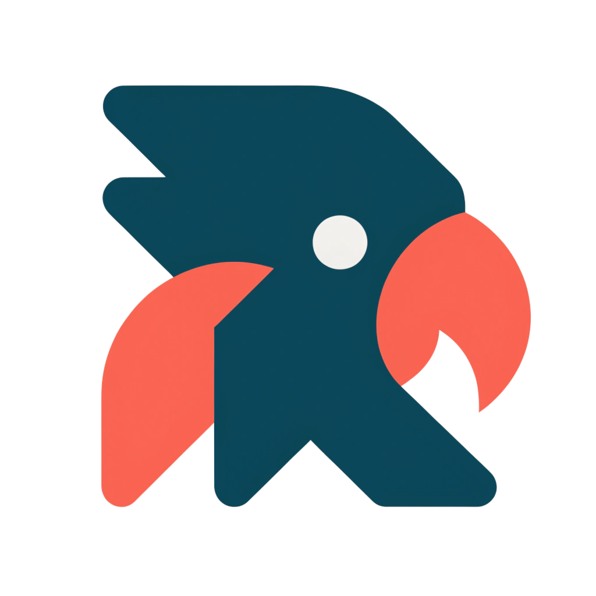
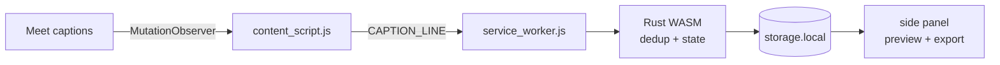

<p align="center">
  
</p>

<h1 align="center">Speaky</h1>

<p align="center">
  Real-time Google Meet transcripts with speaker names — export to JSON, TXT, or Markdown. 100% local.
</p>

<p align="center">
  
  
  
  
</p>

---

Speaky reads Google Meet's built-in captions while you're in a meeting and turns them into a structured, timestamped transcript with speaker names. When you're done, export in one click. Everything runs on your device — no servers, no account, no telemetry.

The transcript engine is written in **Rust/WebAssembly**; the browser integration (DOM, messaging, audio, UI) is JavaScript.

## Features

- 📝 **Real-time transcript** with speaker names and timestamps
- 💾 **Export** to JSON, TXT, or Markdown
- 👀 **Live preview** in the browser side panel while the meeting runs
- 🔔 **Health warning** — badge turns red if captions stop being detected
- 🔒 **Local-only** — no uploads, no telemetry, stored in `chrome.storage.local`
- ⚡ **Rust/WASM core** — dedup of partial caption updates, fast serialization
- 🧪 **Experimental audio mode** (Phase 3) — tab-audio capture + local STT pipeline (Whisper adapter not yet wired)

> ⚠️ **Pre-release.** The DOM selectors in `content/content_script.js` are **placeholders** — Google's obfuscated class names change often, so they must be verified against live Meet before Speaky captures anything. Current status and the phase roadmap live in [PRD.md](PRD.md#8-execution-plan).

## Install (development)

```bash
# Prerequisites: rustup + wasm-pack (cargo install wasm-pack)
wasm-pack build --target web --out-dir pkg
```

1. Open `chrome://extensions/` (or `brave://` / `edge://`).
2. Enable **Developer mode**.
3. **Load unpacked** → select this repo folder.

For a packaged build (Chromium + Firefox zips): `bash scripts/package.sh 0.1.0 all` → see `dist/`.

## Usage

1. Open Google Meet and **turn on Captions (CC)** — Speaky reads Meet's captions.
2. Click the Speaky icon → **Start**.
3. Watch the live preview; the badge warns you if captions stop.
4. When done → **Export** (JSON / TXT / Markdown).

Transcribing others may require their **consent** depending on your jurisdiction — that's on you. See [SECURITY.md](SECURITY.md).

## How it works



Full architecture, data flow, project structure, and the optional audio path are in [PRD.md](PRD.md). Rejected approaches and known limits (why not Web Speech API, why captions over STT) are in [FEASIBILITY.md](FEASIBILITY.md).

## Releasing

Versioning and publishing are **automated from commit messages** (Conventional Commits). Push to `main`:

- `fix:` / `feat:` → stable release → build + publish to Chrome / Edge / Firefox
- `feat(beta):` → `X.Y.Z-beta.N` → GitHub pre-release only (no store)
- `chore:` / `docs:` → no release

Full policy, store secrets, and account setup: [RELEASE.md](RELEASE.md). Store listing copy: [STORE_LISTING.md](STORE_LISTING.md).

## Contributing

Setup, commit conventions, and PR checklist: [CONTRIBUTING.md](CONTRIBUTING.md). Please follow the [Code of Conduct](CODE_OF_CONDUCT.md).

## Documentation

| Doc | What |
|---|---|
| [PRD.md](PRD.md) | Product spec, architecture, phase plan |
| [FEASIBILITY.md](FEASIBILITY.md) | What's not possible + why, alternatives, risk root-causes |
| [RELEASE.md](RELEASE.md) | CI/CD, versioning, store publishing |
| [STORE_LISTING.md](STORE_LISTING.md) | Chrome Web Store listing copy |
| [SECURITY.md](SECURITY.md) | Vulnerability reporting + privacy & consent |

## License

[MIT](LICENSE) © 2026 Dimas Maulana Ahmad.
